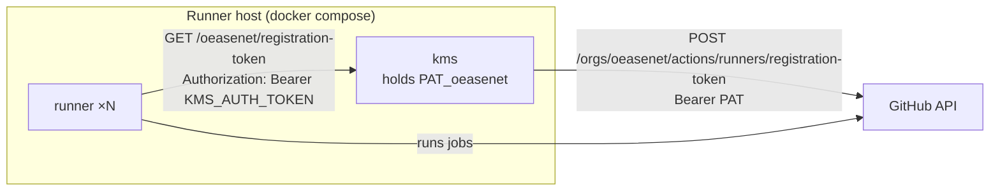

# oease GitHub Actions Runners

Self-hosted GitHub Actions runners for [oease](https://github.com/oeasenet), packaged as two Docker images:

- **`ghcr.io/oeasenet/gha-docker-runner/kms`** – a small Key Management Service that holds the GitHub PAT and hands
  short-lived registration tokens to runners. The PAT never enters a runner container.
- **`ghcr.io/oeasenet/gha-docker-runner/runner`** – an Ubuntu 24.04 runner with the current
  [actions/runner](https://github.com/actions/runner), Docker CLI (buildx + compose), and common build tooling.
  It registers itself through the KMS on start, self-updates, and deregisters cleanly on stop.

[](https://github.com/oeasenet/gha-docker-runner/actions/workflows/docker-build-push.yml)



## Deploy

Requirements on the host: Docker Engine with Compose v2, and access to GHCR (the packages are private, so
`docker login ghcr.io` with a PAT that has `read:packages`).

```bash
git clone https://github.com/oeasenet/gha-docker-runner.git && cd gha-docker-runner
cp .env.example .env
# edit .env: GITHUB_PAT, KMS_AUTH_TOKEN (openssl rand -hex 32), optionally RUNNER_REPLICAS / RUNNER_LABELS
docker compose up -d          # or: make up
```

The runners appear under **Organization → Settings → Actions → Runners** within a minute, named
`oease-<container id>`, with labels `self-hosted`, `Linux`, `X64`/`ARM64` plus anything in `RUNNER_LABELS`.
Target them from workflows with `runs-on: self-hosted` (or `runs-on: [self-hosted, <label>]`).

| Operation                 | Command                                                       |
|---------------------------|---------------------------------------------------------------|
| Status / logs             | `make ps` · `make logs`                                       |
| Scale                     | set `RUNNER_REPLICAS` in `.env`, then `docker compose up -d`  |
| Update to latest images   | `make update` (`docker compose pull && docker compose up -d`) |
| Stop                      | `make down` – runners finish their current job, then deregister |
| KMS dashboard             | http://127.0.0.1:3000 on the host (stats, configured owners, health) |

Stopping a runner waits up to `RUNNER_GRACEFUL_STOP_TIMEOUT` (15 min) for an in-flight job, then removes the
registration from GitHub, so the runner list stays clean. The compose `stop_grace_period` is set accordingly.

### The PAT

`GITHUB_PAT` must be allowed to manage self-hosted runners for `GITHUB_OWNER`:

- classic token: `admin:org` for organization runners, `repo` for repository runners
- fine-grained token: organization permission **Self-hosted runners: Read and write**

Rotate it by editing `.env` and running `docker compose up -d kms`. Several owners can be served by one KMS: add
`PAT_<owner>` variables to the `kms` service (or mount a JSON file `{"owner": "pat"}` at `/app/config.json`).

## Configuration

### KMS (`kms` service)

| Variable         | Description                                                                              | Default            |
|------------------|------------------------------------------------------------------------------------------|--------------------|
| `PAT_<owner>`    | PAT used to mint tokens for `<owner>` (org or user). Repeat per owner.                   | –                  |
| `KMS_AUTH_TOKEN` | Shared secret; token endpoints require `Authorization: Bearer <token>` when set.         | unset (warns)      |
| `CONFIG_FILE`    | Optional JSON file with `{"owner": "pat"}` entries; environment variables override it.   | `/app/config.json` |
| `GITHUB_API_URL` | GitHub REST API base (GitHub Enterprise Server: `https://ghe.example.com/api/v3`).       | `https://api.github.com` |
| `PORT`           | Listen port.                                                                             | `3000`             |

Endpoints: `GET /{org}/registration-token`, `GET /{org}/remove-token`, `GET /repo/{owner}/{repo}/registration-token`,
`GET /repo/{owner}/{repo}/remove-token` (all require the bearer token when `KMS_AUTH_TOKEN` is set), plus the
unauthenticated `GET /` dashboard, `GET /health`, `GET /api/stats` and `GET /api/config` (never exposes secrets).
Only owners with a configured PAT are served; anything else is `404`, GitHub failures surface as `502`.

### Runner (`runner` service)

| Variable                       | Description                                                                          | Default            |
|--------------------------------|--------------------------------------------------------------------------------------|--------------------|
| `KMS_SERVER_ADDR`              | KMS base URL. **Required.**                                                          | –                  |
| `RUNNER_REGISTER_TO`           | `org` for organization runners or `owner/repo` for repository runners. **Required.** | –                  |
| `KMS_AUTH_TOKEN`               | Must match the KMS.                                                                  | –                  |
| `RUNNER_NAME_PREFIX`           | Runner name becomes `<prefix>-<hostname>` (unique per container).                    | –                  |
| `RUNNER_NAME`                  | Explicit runner name (only with a single replica).                                   | hostname           |
| `RUNNER_LABELS`                | Extra labels, comma-separated.                                                       | –                  |
| `RUNNER_GROUP`                 | Runner group (organization runners).                                                 | Default            |
| `RUNNER_WORKDIR`               | Job work directory (`--work`).                                                       | `_work`            |
| `RUNNER_EPHEMERAL`             | `true` = one job per registration, then the container restarts clean.               | `false`            |
| `RUNNER_DISABLE_UPDATE`        | `true` = never self-update the runner binary (rely on image updates).               | `false`            |
| `RUNNER_GRACEFUL_STOP_TIMEOUT` | Seconds to wait for a running job on stop.                                           | `900`              |
| `ADDITIONAL_PACKAGES`          | apt packages installed on start, comma-separated.                                    | –                  |
| `ADDITIONAL_FLAGS`             | Extra `config.sh` flags, e.g. `--no-default-labels`.                                 | –                  |
| `GITHUB_URL`                   | GitHub base URL (GitHub Enterprise Server).                                          | `https://github.com` |
| `KMS_RETRY_INTERVAL` / `KMS_MAX_ATTEMPTS` | Retry pacing while the KMS is unavailable.                                | `5` / `60`         |

**Docker in jobs.** The compose file mounts `/var/run/docker.sock`, so `docker build`, `docker run` and
`docker compose` work inside jobs through the host daemon. This is root-equivalent on the host: only run trusted
workflows on these runners, or remove the mount. Bind mounts inside jobs (`docker run -v $PWD:/x`) resolve on the
host, so they only work if the work directory is bind-mounted at the same path in the container
(`RUNNER_WORKDIR=/srv/gha/_work` + `- /srv/gha/_work:/srv/gha/_work`), one replica per path.

**Runner updates.** GitHub stops scheduling jobs on runners that are too far behind the current release. By default
the runners self-update in place, and CI rebuilds both images weekly with the latest `actions/runner` release, so
`make update` also moves the fleet forward. Ephemeral runners start from the image every time – pair
`RUNNER_EPHEMERAL=true` with `RUNNER_DISABLE_UPDATE=true` and keep the image current.

## Images and CI

`.github/workflows/docker-build-push.yml` builds and pushes both images to GHCR for `linux/amd64` and
`linux/arm64`, signed with [cosign](https://github.com/sigstore/cosign) (keyless, via the workflow's OIDC identity).
No secrets to configure: it authenticates with the workflow's `GITHUB_TOKEN`.

| Trigger                    | What happens                                                                      |
|----------------------------|-----------------------------------------------------------------------------------|
| push to `main`             | tests, then builds only the images whose sources changed → `latest`, `main`, `sha-<commit>` |
| tag `vX.Y.Z`               | builds both → `X.Y.Z`, `X.Y`                                                      |
| pull request               | tests + `linux/amd64` build, nothing pushed                                       |
| weekly (Mon 06:00 UTC) / manual | builds both with fresh base images and the latest `actions/runner` release; the runner image also gets a `runner-<version>` tag |

Dependabot keeps the base images, actions and Go modules current; merging its PRs republishes the images.

Verify a signature:

```bash
cosign verify ghcr.io/oeasenet/gha-docker-runner/runner:latest \
  --certificate-identity-regexp 'https://github.com/oeasenet/gha-docker-runner/' \
  --certificate-oidc-issuer https://token.actions.githubusercontent.com
```

## Development

```bash
make test            # Go unit tests (KMS) + hermetic bash tests (runner entrypoint)
make build           # build both images for the local platform
make build-runner RUNNER_VERSION=2.337.0
make push TAG=dev    # multi-arch build + push (make login first; needs write:packages)
make runner-version  # latest actions/runner release
```

Layout:

```
kms/        Go service (stdlib only) + dashboard template + tests
runner/     Dockerfile, entrypoint.sh, test/entrypoint_test.sh
docker-compose.yml, .env.example     deployment
.github/workflows/docker-build-push.yml, .github/dependabot.yml
```

## Security notes

- Keep the KMS on the internal compose network; it is only published on `127.0.0.1` by default. Anyone who can
  reach its token endpoints with the bearer token can register runners for the organization.
- Always set `KMS_AUTH_TOKEN` in production. Without it the KMS serves tokens to any client that can reach it and
  logs a warning at start.
- Use the narrowest PAT that can manage runners, and rotate it periodically.
- Runners execute workflow code as root inside their container, with access to the host's Docker daemon when the
  socket is mounted. Treat the runner host as part of your CI trust boundary.

## Troubleshooting

| Symptom                                               | Check                                                                          |
|-------------------------------------------------------|--------------------------------------------------------------------------------|
| runner logs `KMS unavailable … retrying`              | `docker compose logs kms`; `KMS_AUTH_TOKEN` mismatch shows as `error: 401`     |
| KMS answers `502 github api returned 401/403/404`     | PAT expired, wrong scopes, or the org name in `GITHUB_OWNER` does not match     |
| KMS answers `404 no PAT configured for "…"`           | `RUNNER_REGISTER_TO` owner has no `PAT_<owner>` on the KMS                     |
| `config.sh` fails with `NotFound` from GitHub         | the token was rejected by GitHub (usually a PAT without runner permissions)     |
| runner shows offline on GitHub after a restart        | it re-registers with `--replace`; stale entries disappear once a runner with the same name is back or after GitHub's cleanup |
| jobs cannot mount volumes into containers             | see *Docker in jobs* above                                                     |

## License

Apache License 2.0 – see [LICENSE](LICENSE) and [NOTICE](NOTICE).

Originally created by [FantasticTony](https://ftan.dev); now developed and maintained as part of oease.
Runner container design inspired by [knatnetwork/github-runner](https://github.com/knatnetwork/github-runner).
