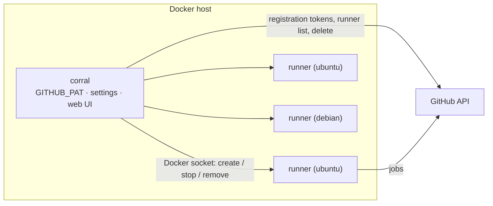

# corral

**Self-hosted GitHub Actions runners on one Docker host, run by a single container.**

[](https://github.com/oeasenet/corral/actions/workflows/docker-build-push.yml)
[](LICENSE)

corral is a small controller that talks to the Docker daemon on the machine it runs on, keeps the
runner containers you asked for registered with GitHub, replaces broken or outdated ones without
interrupting jobs, keeps their images on the latest `actions/runner` release by itself, and gives you a
plain web UI and JSON API to change all of that at runtime.



**When to use it.** You have one machine (or a few, each with its own corral) and want GitHub Actions
runners on it without hand-written compose files, cron jobs for updates or Kubernetes. If you run
Kubernetes, [actions-runner-controller](https://github.com/actions/actions-runner-controller) is the
better fit.

## Quick start

Two images, published to GHCR and Docker Hub — use whichever registry you prefer:

|            | GHCR                                       | Docker Hub                       |
|------------|--------------------------------------------|----------------------------------|
| controller | `ghcr.io/oeasenet/corral`                  | `oease/corral`                   |
| runners    | `ghcr.io/oeasenet/corral/runner:<flavor>`  | `oease/corral-runner:<flavor>`   |

On a host with Docker Engine and Compose v2, put these two files in a directory:

`compose.yaml`

```yaml
services:
  corral:
    image: ghcr.io/oeasenet/corral:latest    # or: oease/corral:latest
    restart: unless-stopped
    environment:
      GITHUB_OWNER: ${GITHUB_OWNER}          # organization; for a single repository use RUNNER_REGISTER_TO=owner/repo
      GITHUB_PAT: ${GITHUB_PAT}              # token that can manage self-hosted runners (see below)
      # ADMIN_PASSWORD: ${ADMIN_PASSWORD}    # optional dashboard login (user: admin)
      # RUNNER_COUNT: "2"                    # first pool's size; everything else is changed in the dashboard
      # RUNNER_IMAGE: oease/corral-runner:ubuntu   # pull runner images from Docker Hub instead of GHCR
    volumes:
      - /var/run/docker.sock:/var/run/docker.sock
      - corral-data:/data
    ports:
      - "8080:8080"                          # dashboard; "127.0.0.1:8080:8080" keeps it local to the host

volumes:
  corral-data:
```

`.env`

```
GITHUB_OWNER=your-org
GITHUB_PAT=ghp_your_token
```

Then:

```bash
docker compose up -d
open http://<host>:8080       # the dashboard
```

Prefer the repository's fuller `docker-compose.yml` (every option as an `.env` variable, `make` helpers)?
`git clone https://github.com/oeasenet/corral.git && cd corral && cp .env.example .env && docker compose up -d`.

`GITHUB_PAT` must be allowed to manage self-hosted runners for `GITHUB_OWNER`: a classic token with
`admin:org` (organization runners) or `repo` (repository runners), or a fine-grained token with the
organization permission **Self-hosted runners: Read and write**. It never leaves the controller; runners
only receive a one-hour registration token when they are created.

Within a minute the runners appear under **Settings → Actions → Runners** of your organization (or
repository, with `RUNNER_REGISTER_TO=owner/repo`), labelled `self-hosted`, `Linux`, `X64`/`ARM64`, their
OS (`ubuntu`, `ubuntu-26.04`, …) and whatever you configure. Use them like this:

```yaml
jobs:
  build:
    runs-on: [self-hosted, ubuntu]
```

The dashboard has no login by default (it is meant to sit behind your firewall). Set `ADMIN_PASSWORD` in
`.env` to require one (user `admin`), and `BIND_ADDR=127.0.0.1` to keep it local to the host.

## Features

- **Pools.** A pool is one runtime environment with its own runner count, labels, runner group and
  options. Run Ubuntu and Debian side by side; scale each with **+ / −**; add or delete pools in the UI.
- **Flavors.** Runner images for `ubuntu` (26.04), `debian` (13) and `minideb` (Bitnami's Debian 13),
  each with the current [actions/runner](https://github.com/actions/runner), the Docker CLI (buildx +
  compose) and common build tooling — or any custom image. Adding a flavor is one directory
  ([below](#adding-a-flavor)).
- **Automatic OS labels.** Every runner labels itself with its flavor and OS (`debian, debian-13`), so
  workflows pick an environment with `runs-on: [self-hosted, debian]`.
- **Automatic updates.** CI publishes new images within hours of an `actions/runner` release (and
  rebuilds weekly for OS patches); the controller pulls each pool's image every hour and replaces idle
  runners built from an older image, one at a time. Persistent runners also self-update in place.
- **Never mid-job.** Scaling down, settings changes, image updates and recreation all *drain*: the runner
  finishes its current job, then stops; its replacement is created while it drains.
- **Ephemeral mode** per pool: a fresh container for every job, replaced afterwards.
- **Docker in jobs.** The host's Docker socket is mounted into runners by default, so jobs can build and
  run images; a *host work directory base* makes `docker run -v $PWD:…` inside jobs work too.
- **One binary, no dependencies.** Go standard library only, ~20 MB image, `linux/amd64` and
  `linux/arm64`. Settings live in one JSON file; the JSON API does everything the UI does.

## Day-to-day

| Want to…                      | Do                                                                                       |
|-------------------------------|------------------------------------------------------------------------------------------|
| add / remove runners          | **+ / −** on the pool; extras are drained idle-first                                     |
| run another OS                | **Add pool**, pick the runtime; each pool has its own count, labels and options          |
| kill one specific runner      | **Destroy** on its row (waits for its job, removes it, lowers its pool's count by one)   |
| get a fresh one               | **Recreate** (same, but keeps the count)                                                 |
| change labels, group, image…  | open *Pool settings*, save: runners roll one at a time, idle ones first                  |
| update to a new runner image  | happens by itself; **Pull & roll** / **Pull all** do it right now                        |
| see what happened             | *Events* (also on `docker compose logs`)                                                 |
| stop everything               | scale pools to 0 (drains all), then `make down`; the controller can restart any time — runners keep working without it |

Settings live in the `corral-data` volume (`/data/settings.json`); the `RUNNER_*` variables in `.env`
only seed the first pool on the first start.

**How the loop works.** Every 30 s (and after every UI action) the controller compares desired and actual
state per pool: exited or unhealthy containers are removed and replaced, missing runners are created with
fresh registration tokens, extra ones are drained (idle and oldest first), outdated ones (settings or
image changed) are rolled one per pool per pass, runners of deleted pools retire, and offline GitHub
registrations that lost their container are deleted. Every hour it also pulls the pools' images and looks
up the latest `actions/runner` release, which the header shows next to what your images run.

## Configuration

### Controller (`corral` service environment)

| Variable | Description | Default |
|---|---|---|
| `GITHUB_PAT` | PAT that can manage the runners. **Required.** | – |
| `GITHUB_OWNER` / `RUNNER_REGISTER_TO` | Organization, or `owner/repo` for repository runners. **One is required.** | – |
| `ADMIN_PASSWORD` | Optional dashboard/API password (user `admin`); unset = no authentication. | – |
| `RUNNER_RUNTIME` | Runtime of the first pool: a flavor name or `custom` (first start only). | `ubuntu` |
| `RUNNER_COUNT`, `RUNNER_LABELS`, `RUNNER_GROUP`, `RUNNER_IMAGE`, `RUNNER_EPHEMERAL`, `RUNNER_DOCKER_SOCKET`, `RUNNER_WORK_BASE`, `RUNNER_EXTRA_ENV`, `RUNNER_GRACEFUL_STOP_TIMEOUT` | The first pool's initial settings (first start only); `RUNNER_IMAGE` is an optional image override. | `2`, –, –, –, `false`, `true`, –, –, `900` |
| `AUTO_UPDATE` | Pull pool images periodically and roll runners built from older ones. | `true` |
| `UPDATE_CHECK_INTERVAL` | How often; `0` disables the automatic check. | `1h` |
| `RUNNER_NAME_PREFIX` | Runner names are `<prefix>-<pool>-<6 hex>`. | `corral` |
| `REGISTRY_USERNAME` / `REGISTRY_PASSWORD` | Credentials for pulling runner images from a private registry. | – |
| `DOCKER_HOST` | Daemon address (`unix://…` or `tcp://…`). | `unix:///var/run/docker.sock` |
| `RUNNER_DOCKER_SOCKET_PATH` | Host socket path mounted into runners. | `/var/run/docker.sock` |
| `RECONCILE_INTERVAL` | Loop period. | `30s` |
| `FLAVORS_DIR` | The flavor catalog (baked into the image; `../images` when running from source). | `/etc/corral/images` |
| `GITHUB_URL`, `GITHUB_API_URL` | GitHub Enterprise Server: `https://ghe.example.com`, `https://ghe.example.com/api/v3`. | github.com |
| `PORT`, `DATA_DIR` | Listen port, settings directory. | `8080`, `/data` |

### Pool settings

`runtime` (a flavor or `custom`), `image` (override; blank = `ghcr.io/oeasenet/corral/runner:<runtime>`,
pin e.g. `…:ubuntu-2.336.0`), `count`, `labels` (comma-separated, added to the automatic ones), `group`
(organization runner group), `ephemeral`, `docker_socket`, `work_base` (absolute host path; each runner
gets `<work_base>/<name>` bound at the identical path), `extra_env` (`KEY=value` per line, e.g.
`ADDITIONAL_PACKAGES=kubectl`), `graceful_stop_seconds` (how long a stopping runner waits for its job).
Changing anything but `count` reshapes the pool's runners, which are then rolled one at a time.

### API

Open by default; with `ADMIN_PASSWORD` set, every endpoint except `/health` requires basic auth.

```
GET    /api/state                       pools with their runners (Docker + GitHub status), events, latest runner release
PUT    /api/settings                    {"auto_update": true|false}
PUT    /api/pools/{name}                create or update a pool (any of the pool settings above)
DELETE /api/pools/{name}                remove the pool; its runners retire as they go idle
POST   /api/pools/{name}/scale          {"delta": 1} or {"count": 5}
POST   /api/pools/{name}/pull           pull that pool's image, roll outdated runners
POST   /api/pull                        same for every pool
POST   /api/runners/{name}/destroy      drain + remove, pool count − 1
POST   /api/runners/{name}/recreate     drain + remove, replaced on the next pass
POST   /api/reconcile                   run a pass now
GET    /health
```

## Runner images

Runner images are published to both registries with identical tags — `ghcr.io/oeasenet/corral/runner`
and `oease/corral-runner` on Docker Hub: `<flavor>` is the latest build of a flavor,
`<flavor>-<runner version>` (e.g. `ubuntu-2.336.0`) pins the `actions/runner` release, and `latest` is
the default flavor (`ubuntu`). The controller pulls from GHCR unless a pool's image override (or
`RUNNER_IMAGE` for the first pool) names another image, e.g. `oease/corral-runner:debian`; GHCR is the
default because it does not rate-limit anonymous pulls.
All flavors ship the same tooling: git, git-lfs, curl, jq, zip/unzip, build-essential, clang, cmake,
Python 3, common dev headers, sudo, and the Docker CLI with buildx and compose. Images carry the labels
`corral.flavor` and `corral.runner-version`.

For a manual `docker run` without the controller, set `RUNNER_REGISTER_TO` and a `RUNNER_TOKEN` (from
`POST /orgs/{org}/actions/runners/registration-token`). Optional: `RUNNER_NAME`, `RUNNER_LABELS`,
`RUNNER_GROUP`, `RUNNER_WORKDIR`, `RUNNER_EPHEMERAL`, `RUNNER_DISABLE_UPDATE`,
`RUNNER_GRACEFUL_STOP_TIMEOUT` (900), `ADDITIONAL_PACKAGES` (apt, comma-separated), `ADDITIONAL_FLAGS`
(extra `config.sh` flags), `GITHUB_URL`, `RUNNER_AUTO_LABELS=false` (skip the flavor/OS labels). On SIGTERM
the entrypoint waits for the running job, then stops the listener.

### Adding a flavor

Flavors are directories under `images/`:

```
images/
  Dockerfile              shared build for any apt-based base (BASE_IMAGE, FLAVOR, GITHUB_RUNNER_VERSION)
  ubuntu/flavor.json      {"label": "Ubuntu 26.04", "base": "ubuntu:26.04", "default": true}
  debian/flavor.json      {"label": "Debian 13", "base": "debian:13"}
  minideb/flavor.json     {"label": "minideb (Debian 13)", "base": "bitnami/minideb:trixie"}
```

1. `mkdir images/<name>` (lowercase letters, digits, dashes; up to 63 characters) and write `flavor.json` with `label` (shown
   in the dashboard) and `base` (the image the shared Dockerfile builds on). Exactly one flavor carries
   `"default": true`.
2. If the shared apt-based build does not fit (a non-Debian base, a very different tool set), add your
   own `Dockerfile` next to it. The build context is `images/`, so it can `COPY entrypoint.sh` and
   `COPY apt-install`. It must accept `ARG GITHUB_RUNNER_VERSION` and `ARG FLAVOR`, set
   `ENV RUNNER_FLAVOR=${FLAVOR}` and the labels `corral.flavor` / `corral.runner-version`, install the
   runner under `/actions-runner` and use `entrypoint.sh` as its entrypoint — the shared Dockerfile is the
   reference.
3. `make build-runner FLAVOR=<name>` and `make smoke-runner FLAVOR=<name>` (the listener must start and
   the OS labels must be right), then push. CI discovers the directory, builds and publishes
   `corral/runner:<name>` for amd64 and arm64, and the dashboard offers it as a runtime.

## Images and CI

`.github/workflows/docker-build-push.yml` builds the controller and every catalogued flavor for amd64 +
arm64, always with the latest `actions/runner` release:

- push to `main`: everything (controller `latest`, `main`, `sha-<commit>`; runner `<flavor>`,
  `<flavor>-<runner version>`, `<flavor>-sha-<commit>`, `latest` for the default flavor);
- `vX.Y.Z` tags: `X.Y.Z` and `X.Y` (runner: `<flavor>-X.Y.Z`, `<flavor>-X.Y`);
- every 6 hours: the runner flavors, only when the latest `actions/runner` release has no image yet;
- Mondays: the runner flavors, always (fresh base image digests, OS patches).

It authenticates with the workflow's `GITHUB_TOKEN`; nothing to configure when you fork it — images land
under your own `ghcr.io/<owner>/corral`. To mirror to Docker Hub as well, add the repository variables
`DOCKERHUB_NAMESPACE` (user or organization the images go to) and `DOCKERHUB_USERNAME`, plus the secret
`DOCKERHUB_TOKEN` (an access token with read & write scope); the workflow then also pushes
`<namespace>/corral` and `<namespace>/corral-runner:<flavor>`. Keep the username a variable, not a
secret: GitHub masks secret values everywhere they appear, image names included. Dependabot keeps the
actions and base images current.

## Security notes

- The controller and (by default) the runners have the host's Docker socket: root-equivalent on that
  host. Treat the runner host as part of your CI trust boundary and only run trusted workflows on it.
- The dashboard is unauthenticated by default: keep it behind your firewall, set `ADMIN_PASSWORD`, or
  bind it to `127.0.0.1`. Anyone who can reach it can scale runners and read events.
- The PAT is only in the controller's environment; registration tokens in runner containers expire after
  one hour and are unset before jobs run.

## Troubleshooting

| Symptom | Check |
|---|---|
| controller exits: `cannot reach the Docker daemon` | `/var/run/docker.sock` must be mounted (see the compose file) |
| event `registration token: github api returned 401/403` | PAT expired or lacks runner permissions for `GITHUB_OWNER` |
| event `pull …: unauthorized` / `manifest unknown` | private registry → set `REGISTRY_USERNAME`/`REGISTRY_PASSWORD`; or the tag does not exist |
| runner shows `unregistered` for minutes | `docker logs <runner>`: `config.sh` output tells you what GitHub rejected |
| GitHub column says `unknown` | GitHub API unreachable; scaling continues, statuses return when it recovers |
| runners keep being `recreated` | they are unhealthy: `docker logs`, usually a token/permission problem at registration |

## Development

```bash
make test                          # Go unit tests, entrypoint tests, flavor catalog tests
make build                         # controller + the default runner flavor for the local platform
make build-runner FLAVOR=debian    # one flavor;  make build-runners  builds all of them
make smoke-runner FLAVOR=debian    # start it with registration skipped: listener up, OS labels right
make push TAG=dev                  # multi-arch build + push of everything (make login first)
make runner-version                # latest actions/runner release
```

Run the controller from source against your local Docker:
`cd controller && GITHUB_PAT=… GITHUB_OWNER=… DATA_DIR=/tmp/corral FLAVORS_DIR=../images go run .`

```
controller/   Go service: reconciler.go (the loop), update.go (image checks), docker.go, github.go,
              settings.go + pool.go (settings v2), catalog.go (flavors), web.go + templates/ (UI, API)
images/       Dockerfile (shared), <flavor>/flavor.json, entrypoint.sh, apt-install, test/
scripts/      flavors.sh (catalog discovery for CI and make) + tests
docker-compose.yml, .env.example, Makefile, docs/superpowers/specs/ (design notes)
```

## Contributing

Issues and pull requests are welcome. Run `make test` before opening one; the entrypoint and catalog
tests are hermetic bash, the controller tests use fakes for Docker and GitHub. New flavors are the easiest
contribution — see [Adding a flavor](#adding-a-flavor).

## License

Apache License 2.0 – see [LICENSE](LICENSE) and [NOTICE](NOTICE).

Originally created by [FantasticTony](https://ftan.dev); now developed and maintained by
[oease](https://github.com/oeasenet). Runner container design inspired by
[knatnetwork/github-runner](https://github.com/knatnetwork/github-runner).
