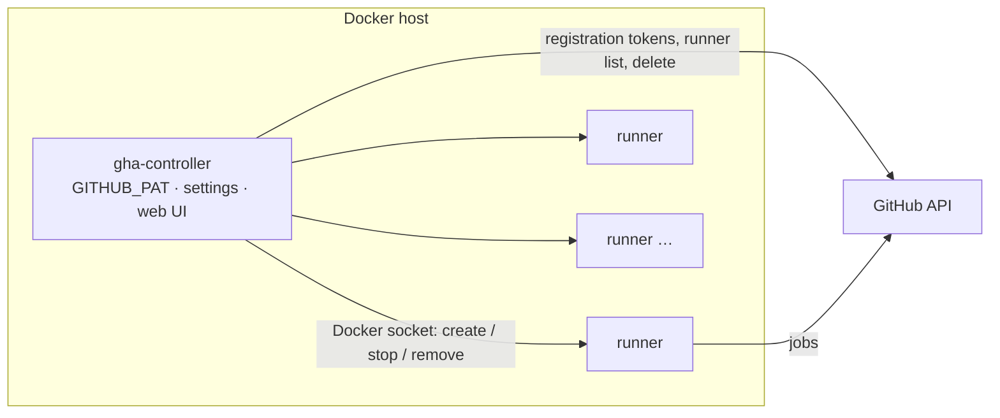

# oease GitHub Actions Runners

Self-hosted GitHub Actions runners for [oease](https://github.com/oeasenet), run by **one container**:
the controller talks to the host's Docker daemon, keeps the desired number of runner containers registered
with GitHub, replaces broken or outdated ones, and gives you a small web UI to change all of that at runtime.

[](https://github.com/oeasenet/gha-docker-runner/actions/workflows/docker-build-push.yml)



Two images, both built for `linux/amd64` and `linux/arm64`:

- **`ghcr.io/oeasenet/gha-docker-runner/controller`** – the manager (Go, no dependencies, ~20 MB).
- **`ghcr.io/oeasenet/gha-docker-runner/runner`** – Ubuntu 24.04 with the current
  [actions/runner](https://github.com/actions/runner), Docker CLI (buildx + compose) and common build tooling.

## Deploy

On a host with Docker Engine + Compose v2:

```bash
git clone https://github.com/oeasenet/gha-docker-runner.git && cd gha-docker-runner
cp .env.example .env         # set GITHUB_PAT and ADMIN_PASSWORD (openssl rand -hex 16)
docker compose up -d          # or: make up
open http://127.0.0.1:8080    # user: admin
```

The controller pulls the runner image, creates `RUNNER_COUNT` containers named `oease-<id>` and they appear
under **Organization → Settings → Actions → Runners** within a minute, labelled `self-hosted`, `Linux`,
`X64`/`ARM64` plus whatever you configure. Target them with `runs-on: self-hosted` (or `[self-hosted, <label>]`).

If the GHCR packages are private, the host needs `docker login ghcr.io` for the controller image, and the
controller needs `REGISTRY_USERNAME`/`REGISTRY_PASSWORD` (a PAT with `read:packages`) to pull the runner image
through the daemon. Making the packages public removes both steps.

### The PAT

`GITHUB_PAT` must be allowed to manage self-hosted runners for `GITHUB_OWNER`:

- classic token: `admin:org` for organization runners, `repo` for repository runners
- fine-grained token: organization permission **Self-hosted runners: Read and write**

It never leaves the controller: runners only receive a one-hour registration token at creation. Rotate it by
editing `.env` and running `docker compose up -d`.

## Day-to-day

Everything below is in the dashboard (`http://127.0.0.1:8080`) and the JSON API behind it.

| Want to…                        | Do                                                                                          |
|---------------------------------|---------------------------------------------------------------------------------------------|
| add / remove runners            | **+1 / −1**, or set *Desired runners* and save; extras are drained idle-first               |
| kill one specific runner        | **Destroy** on its row (waits for its job, removes it, lowers the count by one)             |
| get a fresh one                 | **Recreate** (same, but keeps the count)                                                    |
| change labels, group, image…    | edit *Settings*, save: runners are rolled one at a time, idle ones first, never mid-job     |
| update to a new runner image    | **Pull & roll**: pulls the configured tag, then rolls runners built from the older image    |
| see what happened               | *Events* (also on `docker compose logs`)                                                    |
| stop everything                 | scale to 0 (drains all), then `make down`; the controller itself can restart any time — runners keep working without it |

Settings live in the `gha-data` volume (`/data/settings.json`); the `RUNNER_*` variables in `.env` only seed
them on the first start.

**How the loop works.** Every 30 s (and after every UI action) the controller compares desired and actual
state: exited or unhealthy containers are removed and replaced, missing runners are created with fresh
tokens, extra ones are drained (idle and oldest first), outdated ones (settings or image changed) are rolled
one at a time, and offline GitHub registrations that lost their container are deleted. Draining means
`docker stop` with the graceful timeout, so the runner finishes its current job first.

**Persistent vs ephemeral.** By default runners are persistent: they take job after job and self-update
their binary, so a fleet stays current without any action. Tick *Ephemeral* to get a fresh container per job
(cleanest isolation, ~15 s slower job start, no warm caches); the controller then replaces each runner after
its job.

**Docker in jobs.** *Mount the host Docker socket into runners* (default on) lets jobs run `docker build`,
`docker run` and `docker compose` through the host daemon — root-equivalent on the host, so only run trusted
workflows. Bind mounts inside jobs (`docker run -v $PWD:/x`) resolve on the host; set *Host work directory
base* (e.g. `/srv/gha`) and each runner gets `/srv/gha/<name>` bound at the identical path so that works too.

## Configuration

### Controller (`gha-controller` environment)

| Variable                                  | Description                                                                 | Default                        |
|-------------------------------------------|-----------------------------------------------------------------------------|--------------------------------|
| `GITHUB_PAT`                              | PAT that can manage the runners. **Required.**                              | –                              |
| `GITHUB_OWNER` / `RUNNER_REGISTER_TO`     | Organization, or `owner/repo` for repository runners. **One is required.**  | –                              |
| `ADMIN_PASSWORD`                          | Dashboard/API password (user `admin`); unset = no auth (warns).             | –                              |
| `RUNNER_COUNT`, `RUNNER_LABELS`, `RUNNER_GROUP`, `RUNNER_IMAGE`, `RUNNER_EPHEMERAL`, `RUNNER_DOCKER_SOCKET`, `RUNNER_WORK_BASE`, `RUNNER_EXTRA_ENV`, `RUNNER_GRACEFUL_STOP_TIMEOUT` | Initial settings (first start only). | `2`, –, –, runner:latest, `false`, `true`, –, –, `900` |
| `RUNNER_NAME_PREFIX`                      | Runner names are `<prefix>-<8 hex>`.                                        | `oease`                        |
| `REGISTRY_USERNAME` / `REGISTRY_PASSWORD` | Credentials for pulling a private runner image.                             | –                              |
| `DOCKER_HOST`                             | Daemon address (`unix://…` or `tcp://…`).                                   | `unix:///var/run/docker.sock`  |
| `RUNNER_DOCKER_SOCKET_PATH`               | Host socket path mounted into runners.                                      | `/var/run/docker.sock`         |
| `RECONCILE_INTERVAL`                      | Loop period.                                                                | `30s`                          |
| `GITHUB_URL`, `GITHUB_API_URL`            | GitHub Enterprise Server: `https://ghe.example.com`, `https://ghe.example.com/api/v3`. | github.com          |
| `PORT`, `DATA_DIR`                        | Listen port, settings directory.                                            | `8080`, `/data`                |

### API

All endpoints except `/health` require basic auth when `ADMIN_PASSWORD` is set.

```
GET  /api/state                         settings, runners (Docker + GitHub status), events
PUT  /api/settings                      JSON with any of: count, labels, group, image, ephemeral,
                                        docker_socket, work_base, extra_env, graceful_stop_seconds
POST /api/scale                         {"delta": 1} or {"count": 5}
POST /api/runners/{name}/destroy        drain + remove, count − 1
POST /api/runners/{name}/recreate       drain + remove, replaced on the next pass
POST /api/pull                          pull the image, roll outdated runners
POST /api/reconcile                     run a pass now
GET  /health
```

### Runner image (standalone use)

The controller sets these itself; for a manual `docker run` you need `RUNNER_REGISTER_TO` and a
`RUNNER_TOKEN` (from `POST /orgs/{org}/actions/runners/registration-token`). Optional: `RUNNER_NAME`,
`RUNNER_NAME_PREFIX`, `RUNNER_LABELS`, `RUNNER_GROUP`, `RUNNER_WORKDIR`, `RUNNER_EPHEMERAL`,
`RUNNER_DISABLE_UPDATE`, `RUNNER_GRACEFUL_STOP_TIMEOUT` (900), `ADDITIONAL_PACKAGES` (apt, comma-separated),
`ADDITIONAL_FLAGS` (extra `config.sh` flags), `GITHUB_URL`. On SIGTERM the entrypoint waits for the running
job, then stops the listener; deleting the registration is the controller's job.

## Images and CI

`.github/workflows/docker-build-push.yml` builds both images for amd64 + arm64 and pushes them to GHCR on
every push to `main` (`latest`, `main`, `sha-<commit>`), on `vX.Y.Z` tags (`X.Y.Z`, `X.Y`) and on manual
runs, always with the latest `actions/runner` release (the runner image also gets a `runner-<version>` tag).
It authenticates with the workflow's `GITHUB_TOKEN`; nothing to configure. Dependabot keeps base images and
actions current.

## Development

```bash
make test               # Go unit tests (controller) + hermetic bash tests (runner entrypoint)
make build              # build both images for the local platform
make push TAG=dev       # multi-arch build + push (make login first; needs write:packages)
make runner-version     # latest actions/runner release
```

Run the controller from source against your local Docker: `cd controller && GITHUB_PAT=… GITHUB_OWNER=… DATA_DIR=/tmp/gha go run .`

```
controller/   Go service: docker.go (Engine API), github.go, reconciler.go, web.go + templates/, settings.go
runner/       Dockerfile, entrypoint.sh, test/entrypoint_test.sh
docker-compose.yml, .env.example, Makefile, docs/superpowers/specs/ (design)
```

## Security notes

- The controller and (by default) the runners have the host's Docker socket: root-equivalent on that host.
  Treat the runner host as part of your CI trust boundary and only run trusted workflows on it.
- Set `ADMIN_PASSWORD` and keep the dashboard on `127.0.0.1` or behind Traefik; anyone with access can scale
  runners and read events.
- The PAT is only in the controller's environment; registration tokens in runner containers expire after
  one hour and are unset before jobs run.

## Troubleshooting

| Symptom                                                    | Check                                                                                   |
|------------------------------------------------------------|-----------------------------------------------------------------------------------------|
| controller exits: `cannot reach the Docker daemon`         | `/var/run/docker.sock` must be mounted (see compose file)                               |
| event `registration token: github api returned 401/403`    | PAT expired or lacks runner permissions for `GITHUB_OWNER`                              |
| event `pull …: unauthorized` / `manifest unknown`          | runner package private → set `REGISTRY_USERNAME`/`REGISTRY_PASSWORD`; or wrong tag     |
| runner shows `unregistered` for minutes                    | `docker logs <runner>`: `config.sh` output tells you what GitHub rejected               |
| GitHub column says `unknown`                               | GitHub API unreachable; scaling continues, statuses return when it recovers             |
| runners keep being `recreated`                             | they are unhealthy: `docker logs`, usually a token/permission problem at registration   |

## License

Apache License 2.0 – see [LICENSE](LICENSE) and [NOTICE](NOTICE).

Originally created by [FantasticTony](https://ftan.dev); now developed and maintained as part of oease.
Runner container design inspired by [knatnetwork/github-runner](https://github.com/knatnetwork/github-runner).
