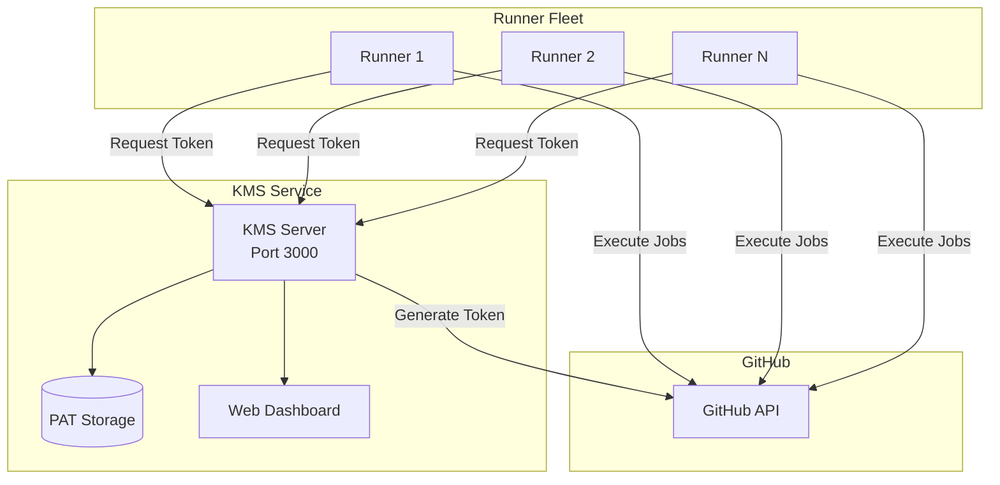

# GitHub Actions Self-Hosted Runners with KMS 🚀

A secure, scalable infrastructure for self-hosted GitHub Actions runners with a Key Management Service (KMS) that
eliminates PAT exposure in runner containers.

[](https://github.com/TuriX-AI/gha-docker-runners/actions/workflows/docker-build-push.yml)

## 🎯 Overview

This project provides a complete solution for running self-hosted GitHub Actions runners with enhanced security through
a dedicated Key Management Service. Instead of embedding Personal Access Tokens (PATs) directly in runner containers,
runners request temporary registration tokens from a centralized KMS service.

### Key Benefits

- **🔐 Enhanced Security**: PATs never enter runner containers
- **🎛️ Centralized Management**: Single point for PAT management
- **📊 Monitoring & Analytics**: Built-in web dashboard for KMS monitoring
- **🔄 Auto-registration**: Runners automatically register and deregister
- **🐳 Docker-based**: Easy deployment with container orchestration
- **📈 Scalable**: Support for multiple organizations and repositories

## 🏗️ Architecture



## 📦 Components

### 1. KMS Service (`/kms`)

A Go-based Key Management Service that securely manages GitHub PATs and generates temporary runner tokens.

**Features:**

- RESTful API for token generation
- Web dashboard for monitoring
- Support for both organization and repository runners
- Request statistics and health checks
- Configurable via environment variables or JSON

**Endpoints:**

- `GET /` - Web dashboard UI
- `GET /health` - Health check endpoint
- `GET /api/stats` - Statistics API
- `GET /api/config` - Configuration info
- `GET /{org}/registration-token` - Organization runner token
- `GET /{org}/remove-token` - Organization remove token
- `GET /repo/{owner}/{repo}/registration-token` - Repository runner token
- `GET /repo/{owner}/{repo}/remove-token` - Repository remove token

### 2. Runner Service (`/runner`)

Docker container for GitHub Actions self-hosted runners with automatic registration.

**Features:**

- Based on Ubuntu 24.04 with latest GitHub Runner
- Automatic registration/deregistration
- Support for custom labels
- Additional package installation
- Graceful shutdown handling

### 3. GitHub Actions Workflows (`/.github/workflows`)

Automated CI/CD pipelines for building and pushing Docker images.

**Workflows:**

- **docker-build-push.yml**: Builds and pushes images on changes
- Smart change detection (only builds modified components)
- Linux AMD64 optimized builds
- Docker layer caching for faster builds

## 🚀 Quick Start

### Prerequisites

- Docker and Docker Compose
- GitHub Personal Access Token with appropriate permissions
- DigitalOcean Container Registry (or modify for other registries)

### 1. Configure KMS

Create a `config.json` file or set environment variables:

**Option A: Configuration File**

```json
{
  "your-org": "ghp_yourPersonalAccessToken",
  "another-org": "ghp_anotherPersonalAccessToken"
}
```

**Option B: Environment Variables**

```bash
export PAT_yourorg=ghp_yourPersonalAccessToken
export PAT_anotherorg=ghp_anotherPersonalAccessToken
```

### 2. Deploy KMS Service

```bash
# Using Docker
docker run -d \
  -p 3000:3000 \
  -e PAT_myorg=ghp_token \
  -v $(pwd)/config.json:/root/config.json \
  registry.digitalocean.com/turix/gha-runner-kms:latest

# Or using Docker Compose
docker-compose up -d kms
```

### 3. Deploy Runners

```bash
docker run -d \
  -e KMS_SERVER_ADDR=http://kms-service:3000 \
  -e RUNNER_REGISTER_TO=your-org \
  -e RUNNER_LABELS=docker,ubuntu-24.04 \
  registry.digitalocean.com/turix/gha-runner:latest
```

## 📋 Configuration

### KMS Configuration

| Environment Variable | Description                     | Default |
|----------------------|---------------------------------|---------|
| `PORT`               | Server port                     | `3000`  |
| `PAT_*`              | GitHub PATs (e.g., `PAT_myorg`) | -       |

### Runner Configuration

| Environment Variable  | Description               | Example                   |
|-----------------------|---------------------------|---------------------------|
| `KMS_SERVER_ADDR`     | KMS service URL           | `http://kms:3000`         |
| `RUNNER_REGISTER_TO`  | GitHub org or repo        | `myorg` or `myorg/myrepo` |
| `RUNNER_NAME`         | Custom runner name        | `runner-1`                |
| `RUNNER_LABELS`       | Runner labels             | `docker,self-hosted`      |
| `RUNNER_WORKDIR`      | Working directory         | `_work`                   |
| `ADDITIONAL_PACKAGES` | Extra packages to install | `docker.io,kubectl`       |
| `ADDITIONAL_FLAGS`    | Extra config flags        | `--ephemeral`             |

## 🐳 Docker Compose Example

```yaml
version: '3.8'

services:
    kms:
        image: registry.digitalocean.com/turix/gha-runner-kms:latest
        ports:
            - "3000:3000"
        environment:
            - PAT_myorg=${GITHUB_PAT}
        volumes:
            - ./config.json:/root/config.json
        restart: unless-stopped

    runner:
        image: registry.digitalocean.com/turix/gha-runner:latest
        environment:
            - KMS_SERVER_ADDR=http://kms:3000
            - RUNNER_REGISTER_TO=myorg
            - RUNNER_LABELS=docker,self-hosted
        depends_on:
            - kms
        restart: unless-stopped
        deploy:
            replicas: 3  # Scale to 3 runners
```

## 🔧 Building from Source

### Build KMS

```bash
cd kms
go build -o kms-server
# Or using Docker
docker build -t gha-runner-kms .
```

### Build Runner

```bash
cd runner
docker build -t gha-runner .
```

## 🌐 Web Dashboard

Access the KMS dashboard at `http://localhost:3000` to monitor:

- 📊 Request statistics
- ✅ Success/failure rates
- 🏢 Configured organizations
- 📈 Real-time metrics
- 🔍 API endpoint documentation

## 🔒 Security Considerations

1. **Never commit PATs** to version control
2. **Use secrets management** for production deployments
3. **Limit PAT scopes** to minimum required permissions:
    - `repo` (for repository runners)
    - `admin:org` (for organization runners)
4. **Network isolation** - Keep KMS service in internal network
5. **TLS/HTTPS** - Use HTTPS in production environments
6. **Regular rotation** - Rotate PATs periodically

## 📊 Monitoring & Observability

### Health Check

```bash
curl http://localhost:3000/health
```

### Statistics API

```bash
curl http://localhost:3000/api/stats | jq
```

## 🚢 Deployment Options

### Kubernetes

Deploy using Helm or kubectl:

```bash
kubectl apply -f k8s/
```

### Docker Swarm

```bash
docker stack deploy -c docker-stack.yml github-runners
```

### DigitalOcean App Platform

Deploy directly to DigitalOcean App Platform using the provided app spec.

## 🔄 CI/CD Pipeline

The project includes GitHub Actions workflows for:

- **Automatic builds** on push to main branch
- **Optimized AMD64 images**
- **Smart change detection** (only builds changed components)
- **Docker layer caching** for faster builds
- **Automatic tagging** with branch and SHA

### Required GitHub Secrets

| Secret          | Description                    |
|-----------------|--------------------------------|
| `DOCR_USERNAME` | DigitalOcean registry username |
| `DOCR_PASSWORD` | DigitalOcean registry password |

## 📝 API Documentation

### Registration Token

```bash
# Organization runner
GET /{org}/registration-token

# Repository runner
GET /repo/{owner}/{repo}/registration-token

Response: Plain text token
```

### Remove Token

```bash
# Organization runner
GET /{org}/remove-token

# Repository runner
GET /repo/{owner}/{repo}/remove-token

Response: Plain text token
```

### Statistics

```bash
GET /api/stats

Response:
{
  "total_requests": 150,
  "successful_requests": 145,
  "failed_requests": 5,
  "requests_by_org": {...},
  "requests_by_repo": {...}
}
```

## 🤝 Contributing

Contributions are welcome! Please feel free to submit a Pull Request.

1. Fork the repository
2. Create your feature branch (`git checkout -b feature/AmazingFeature`)
3. Commit your changes (`git commit -m 'Add some AmazingFeature'`)
4. Push to the branch (`git push origin feature/AmazingFeature`)
5. Open a Pull Request

## 📄 License

This project is licensed under the GPL License - see the [LICENSE](LICENSE) file for details.

## 🙏 Acknowledgments

- Inspired by [knatnetwork/github-runner](https://github.com/knatnetwork/github-runner)
- GitHub Actions Runner team for the self-hosted runner
- The Go community for excellent libraries

## 📚 Resources

- [GitHub Actions Self-Hosted Runners Documentation](https://docs.github.com/en/actions/hosting-your-own-runners)
- [GitHub REST API Documentation](https://docs.github.com/en/rest)
- [DigitalOcean Container Registry](https://docs.digitalocean.com/products/container-registry/)

## 🐛 Troubleshooting

### KMS Service Issues

**Problem**: KMS service won't start

- Check if port 3000 is available
- Verify PAT configuration
- Check logs: `docker logs <container-id>`

**Problem**: Authentication failures

- Verify PAT has correct permissions
- Check PAT hasn't expired
- Ensure organization name matches exactly

### Runner Issues

**Problem**: Runner won't register

- Verify KMS service is accessible
- Check network connectivity between runner and KMS
- Verify organization/repository name is correct

**Problem**: Runner exits immediately

- Check KMS_SERVER_ADDR is set correctly
- Verify runner can reach GitHub API
- Check runner logs for specific errors

---

Made with ❤️ for the GitHub Actions community by [FantasticTony](https://ftan.dev)